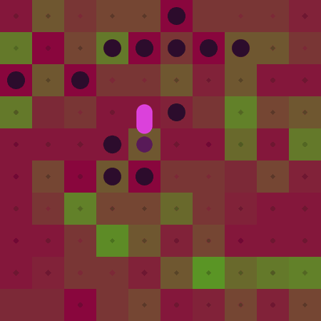
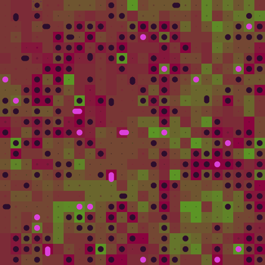

# Evolution Simulation Cellular Automaton

A simple simulation using a cellular automaton system designed to explore evolution caused by emergent behaviors.






## Features

- Tile-based world with cells representing **organisms**

- Each cell has **age** and **energy**

- Simple rules for **energy harvesting**, **reproduction** and **death**

- Visualizes evolution over time with **step-by-step updates**

## Getting started

### Dependencies

- [SDL](https://github.com/libsdl-org/SDL) and [SDL_image](https://github.com/libsdl-org/SDL_image) for graphics - SDL2

- [Nuklear](https://github.com/Immediate-Mode-UI/Nuklear) for the GUI

- [Microsoft Visual C++ Runtime](https://learn.microsoft.com/en-us/cpp/windows/latest-supported-vc-redist) (only if you're on Windows)

### Build

Linux (GCC):

```
gcc -std=c17 -Wall -O2 main.c -o evolution-sim -I<SDL2 include path> -I<Nuklear include path> \
-L<lib path> -lSDL2 -lSDL2_image -lm
```

Windows (MSVC):

```
cl /std:c17 /W4 /O2 main.c /Fe:evolution-sim.exe /I"<SDL2 include path>" ^
/I"<SDL2_image include path>" /I"<Nuklear include path>" /link Shell32.lib ^
/LIBPATH:"<SDL2 lib path>" SDL2main.lib SDL2.lib /LIBPATH:"<SDL2_image lib path>" ^
SDL2_image.lib /SUBSYSTEM:WINDOWS
```

## Controls

- **Left click** - select tile/track cell

- **Right click drag** - camera panning

- **Mouse wheel** - zoom

## Rules

### Basics

The world is a **tilemap**, where each tile can house a cell. Each cell has two basic properties: **age** and **energy**. Energy is the foundation of all life. When a cell runs out of energy, it **dies**.

### Generation

At world generation, each tile is assigned a random energy source value, ranging from 0 to 75.
The possible energy source values' probabilities are **weighted** so that **lower values** are **more likely**.
Each tile also has a **10% (1 in 10) chance** to **house a live cell**.
Each initial live cell starts with a **random** amount of energy, ranging from 5 to 10.

### Advancement

Every generation, a live cell's age **increases** by 1.
Every 10 generations, the energy of every tile in the world increases by 1.

#### Energy harvesting

If a live cell is on a tile with **available energy**, it will **harvest** up to 5 energy, with the harvested amount of energy being **based on the following rules**:

- if the available energy is **100 or greater**, the cell harvests **3 energy**

- otherwise, if the available energy is **50 or greater**, the cell harvests **2 energy**

- otherwise, the cell harvests **1 energy**

- if the cell is **at least 40 generations old**, it harvests an additional **2 energy**

- otherwise, if the cell is **at least 20 generations old**, it harvests an additional **1 energy**

- otherwise, the cell **doesn't harvest any additional energy**

Of course, the actual harvested amount is limited by how much energy is **available**, and a cell **can't harvest more energy than the tile below it can provide**.

#### Living cost

Every live cell's energy **decreases** by $ceil(age / 100)$ every generation.

#### Reproduction

Every cell that has **at least 10 energy**, is **at least 10 generations old** and has **at least 1 free tile** out of its **4 adjacent tiles** has a **12.5% (1 in 8) chance** to divide itself into two cells, **splitting the mother cell's energy equally**, and **losing a unit of energy if the mother cell's energy is odd**.
When a cell divides itself, one daughter cell **stays on the same tile** as the mother cell, while the other is born on **the most energy-rich free tile out of the 4 adjacent tiles** to the original mother cell.
The daughter cell that stays on the same tile **inherits the mother cell's age**, while the other one **starts at 0 age**.
Both cells have a **50% (1 in 2) chance each** for **each evolution** from the **mother cell** to **inherit** it.

#### Evolution

If certain conditions are met, a cell has a chance to **evolve to unlock a new ability/trait**.
Every evolution has to be **a certain minimum age or above**, requires **a certain amount of energy** and also takes **a certain number of generations** to complete, during which the cell **cannot act** - it cannot harvest more energy and cannot divide.
Once a cell enters evolution, **every generation** of the evolution, **a percentage** of the **total energy required for the evolution** is **subtracted** from the cell's available energy.
If the living cost causes the cell to run out of energy, **it dies** as usual, so **every evolution attempt carries a risk**.
Every evolution also has a chance to be lost if unused in a generation, triggering **regressive evolution**.

*Motility*

When a cell has this evolution, if it has **at least** 3 energy **after** the living cost is applied, and **there's a tile** out of its **4 adjacent tiles** that has **more energy** than its current tile, it will move to that tile, spending **1 energy** in the process.
If there are **multiple** adjacent tiles with more energy, it moves to **the most energy-rich** one.

- eligibility: 20 age
- cost: 20 energy
- timescale: 5 generations
- acquistion probability: 50% (1 in 2)
- loss probability: 4% (1 in 25)

*Polydivision*

When a cell has this evolution, the **minimum energy** required for its **reproduction** is **doubled** to 20, and its reproduction **chance** is **halved** to **6.25% (1 in 16)**.
However, instead of dividing itself into two cells, it divides itself into **as many cells as it can with the current provided space**, i.e. **the number of free adjacent tiles**, allowing for it to divide itself into **up to 5 cells** without **any additional energy costs** (aside from its already doubled requirement).
The energy of the mother cell is **split equally** between all new cells, **losing** all energy that **can't** be equally split.
Only the daughter cell **on the tile of the original mother cell** retains the mother cell's age.

- eligibility: 40 age
- cost: 10 energy
- timescale: 10 generations
- acquistion probability: 25% (1 in 4)
- loss probability: 2.5% (1 in 40)

*Energosynthesis*

When a cell has this evolution, it has a **50% (1 in 2) chance** to **generate 1 energy** every generation.
If it has **at least 1 free neighboring cell**, it will **always** generate 1 energy.
Additionally, if it has **at least 4 free neighboring tiles**, it generates an **extra 1 energy**, and if **all 8 neighboring tiles** are **free**, it generates **another extra 1 energy**, summing up to a total maximum of **3 energy** per generation, if all neighboring tiles are free.
The energy is generated **before the living cost is applied**.

- eligibility: 100 age
- cost: 30 energy
- timescale: 15 generations
- acquistion probability: 10% (1 in 10)
- loss probability: 12.5% (1 in 8)

#### Limits

A cell can only do one of the following during a single generation, and the priority is as listed:

1. act "instinctively" - i.e. use an ability acquired through evolution
2. divide itself
3. initiate an evolution process

#### Death

A cell **dies** when **its energy reaches 0** after the living cost is applied.
When a cell dies, the energy of the tile below it **increases** by **the age of the now dead cell**.

## Current development state

I'm working on this project solo.
I was inspired by Conway's game of life, and decided to make something more complex and "alive", less order-based and more chaos-based.
The rendering engine is written in C with SDL2 and SDL2_image for graphics and Nuklear for the GUI.
It currently lacks a mipmap system, so zooming out too far causes performance issues.

## Future plans

- better rendering optimization and mipmap implementation

- intervention, control and more simulation parameters

- more evolutions, as well as mutations, cell clusters, and generally more complex cell behavior

- option to save simulation state

- cleaner GUI and a custom GUI implementation
